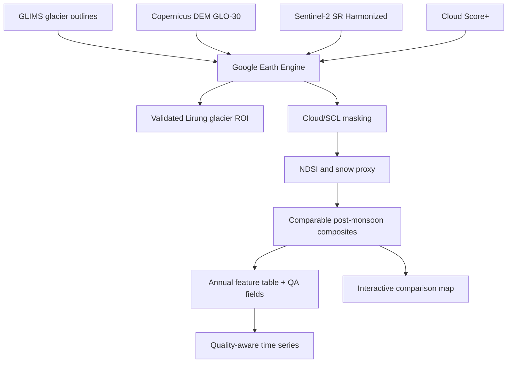

# Environmental conditioning and multisensor change analysis around the 2026 Langtang Lirung event

An open-source, Colab-first V2 research workflow for examining multi-temporal
environmental change around Lirung Glacier, Nepal. The current release implements
Phases 1--10 plus a dedicated V2 QA notebook: reproducible setup, an inventory-based glacier ROI, Sentinel-2
post-monsoon snow-cover proxies, ERA5-Land regional climate context, and comparable-
track Sentinel-1 backscatter analysis, followed by a quality-aware monthly feature
store, statistical trend/change-point diagnostics, and unsupervised anomaly and
environmental-regime screening, guarded event-relative comparisons, and an
integrated evidence dashboard. It does
**not** claim to predict glacier collapse or establish causes of the reported event.

V2 adds central quality decisions, matched-period climate comparisons, explicit
sensor-coverage rejection, Sentinel-1 orbit/angle diagnostics, proxy-threshold
sensitivity, feature provenance, autocorrelation-aware statistics, QA-gated spatial
change candidates, terrain/hydrology context, and evidence-graded conclusions.

## Objective and research questions

The long-term objective is to test whether satellite, terrain, and climate records
show trends, short-lived anomalies, or landscape changes associated with conditions
before and after a documented event. The implemented phases build a traceable
multisensor baseline, exploratory anomaly screen, and citation-gated pre/post
comparison. Event attribution and prediction are deliberately excluded.

## Architecture



Reusable code lives in `src/`; notebooks orchestrate it and write small derived
tables/figures to `outputs/`. Earth Engine remains the source of pixel data.

## Dataset IDs used in executable code

| Purpose | Earth Engine ID |
|---|---|
| Glacier outline | `GLIMS/current` |
| Surface reflectance | `COPERNICUS/S2_SR_HARMONIZED` |
| Pixel quality | `GOOGLE/CLOUD_SCORE_PLUS/V1/S2_HARMONIZED` |
| Elevation context | `COPERNICUS/DEM/GLO30_2024_1` |
| Regional climate context | `ECMWF/ERA5_LAND/DAILY_AGGR` |
| SAR backscatter | `COPERNICUS/S1_GRD` |
| Hydrological terrain | `MERIT/Hydro/v1_0_1` |
| Level-12 catchment | `WWF/HydroSHEDS/v1/Basins/hybas_12` |

See [docs/datasets.md](docs/datasets.md) for resolution, coverage, and limitations.

## ROI definition and source

The glacier ROI is selected from `GLIMS/current` using later published GLIMS ID
`G085544E28246N`, with older ID `G085547E28252N` retained as an inventory-vintage
alias (Lirung Glacier; approximate documented anchor 85.547°E, 28.252°N). GLIMS IDs
encode representative coordinates and can change between inventory versions. The
resolver accepts either documented ID near the anchor, or an unambiguous nearby
feature named `Lirung`, and reports the selection method. When repeated outlines
exist, it selects the newest `src_date`. It raises an error rather than silently
substituting a hand-drawn polygon. The 15 km and 25 km bounding geometries are
visualization/analysis context only; neither is a drainage basin nor a mapped 2026
event footprint.

Sources: the identifier is given in an [ICIMOD glacier database training
manual](https://lib.icimod.org/records/85kzq-8hk08), while the inventory is
described by [GLIMS/NSIDC](https://nsidc.org/data/nsidc-0272/versions/1).

## Repository structure

```text
notebooks/  Ten phase notebooks plus the V2 quality-assurance notebook
src/        Configuration, GEE, feature, and visualization modules
data/       Local raw/processed cache locations (not committed)
outputs/    Generated maps, charts, and tables (not committed)
docs/       Methods, datasets, and scientific limitations
tests/      Offline unit tests for configuration and notebook structure
```

Every implemented phase has an executable notebook; unavailable observations remain
explicitly pending rather than being replaced with placeholder results.

## Installation and Google Earth Engine setup

1. Register an Earth Engine-enabled Google Cloud project.
2. Open `notebooks/01_setup_and_roi.ipynb` in Colab.
3. Set `EE_PROJECT` to your project ID, then run all cells. The notebook installs
   dependencies and calls `ee.Authenticate()` followed by `ee.Initialize()`.
4. Run notebooks 02 through 09, then notebook 11 for V2 QA, and finally notebook 10
   so its dashboard inventories the QA products. If using separate Colab runtimes,
   rerun each notebook's initialization cell.

For a local environment:

```bash
python -m venv .venv
source .venv/bin/activate
pip install -r requirements.txt
python -m unittest discover -s tests -v
```

## Methodology and outputs

The default comparison window is October--November for every year from 2017 to
2026. Surface reflectance is scaled to [approximately] 0--1; Cloud Score+
`cs_cdf >= 0.60` and invalid/cloud/shadow/saturated SCL classes are masked. SCL
snow class 11 is retained because snow is then re-derived consistently with NDSI.
Snow is provisionally mapped where NDSI >= 0.40 and green reflectance >= 0.10.
All thresholds are configurable in `src/config.py`.

Successful online execution produces:

- `outputs/maps/study_area.html`
- `outputs/maps/sentinel2_representative_years.html`
- `outputs/tables/sentinel2_annual_snow_metrics.csv`
- `outputs/charts/sentinel2_post_monsoon_snow_proxy.png`
- `data/processed/era5_land_daily_1984_2026.csv`
- `outputs/tables/era5_land_monthly_climate.csv`
- `outputs/charts/era5_land_temperature.png`
- `outputs/charts/era5_land_precipitation.png`
- `outputs/charts/era5_land_pdd.png`
- `outputs/tables/sentinel1_monthly_sar_metrics.csv`
- `outputs/charts/sentinel1_backscatter_timeseries.png`
- `outputs/maps/sentinel1_representative_years.html`
- `outputs/maps/sentinel1_pre_post_change.html` (only with verified windows)
- `outputs/tables/sentinel2_monthly_snow_metrics.csv`
- `outputs/tables/langtang_monthly_features.csv`
- `outputs/charts/integrated_feature_availability.png`
- `outputs/tables/trend_summary.csv`
- `outputs/tables/correlation_pearson.csv`
- `outputs/tables/lagged_correlations.csv`
- `outputs/tables/change_point_diagnostics.csv`
- `outputs/charts/seasonally_adjusted_trends.png`
- `outputs/charts/correlation_heatmap.png`
- `outputs/tables/langtang_monthly_features_with_anomaly.csv`
- `outputs/tables/anomaly_scores.csv`
- `outputs/tables/pca_loadings.csv`
- `outputs/tables/cluster_diagnostics.csv`
- `outputs/tables/anomaly_model_diagnostics.json`
- `outputs/charts/anomaly_score_timeseries.png`
- `outputs/charts/environmental_regimes_pca.png`
- `outputs/tables/event_windows.json` (only with a verified citation and dates)
- `outputs/tables/pre_event_historical_percentiles.csv`
- `outputs/charts/pre_event_historical_percentiles.png`
- `outputs/tables/sentinel2_event_metrics.csv`
- `outputs/tables/sentinel1_event_metrics.csv`
- `outputs/maps/sentinel2_event_pre_post.html`
- `outputs/maps/sentinel1_event_pre_post.html`
- `outputs/charts/integrated_event_timeline.png`
- `outputs/tables/research_output_inventory.csv`
- `outputs/tables/research_question_summary.csv`
- `outputs/research_conclusions.md`
- `outputs/research_dashboard.html`
- `outputs/qa/climate_matched_august_1_24.csv`
- `outputs/qa/climate_event_antecedent_windows.csv`
- `outputs/qa/feature_provenance.csv`
- `outputs/qa/sentinel1_candidate_track_qa.csv` (after full online QA)
- `outputs/qa/sentinel1_angle_mask_sensitivity.csv` (after full online QA)
- `outputs/qa/sentinel2_proxy_trend_sensitivity.csv` (after full online QA)
- `outputs/qa/roi_provenance.json`
- `outputs/v2_research_conclusions.md`

No numerical result is committed because this environment has no authenticated
Earth Engine session. The notebooks obtain real values at runtime and fail clearly
on empty collections.

## Responsible interpretation and limitations

The output is a spectral **snow/clean-ice proxy inside an inventory outline**, not
a measurement of total glacier area. Debris-covered ice may be spectrally similar
to surrounding rock. Residual cloud, terrain shadow, changing observation density,
and an old inventory boundary can bias comparisons. Always examine
`valid_area_fraction`, observation counts, and composites before interpreting the
time series. See [docs/limitations.md](docs/limitations.md).

ESA reports that the event occurred on the morning of 26 August 2026 in its
[satellite summary](https://www.esa.int/Applications/Observing_the_Earth/Copernicus/Sentinel-2/Nepal_flash_flood_imaged_by_satellites).
`SETTINGS.event_date` remains `None` so event-relative execution cannot begin
silently: notebook 09 requires the user to record that citation and explicit,
end-exclusive comparison windows with the generated outputs.

## Future work

Future work should add field validation, independent event inventories, locally
calibrated classifications, uncertainty propagation, co-registered elevation-change
data, and prospective multi-event evaluation before any hazard or predictive claim.
